# TuffBoy

A handheld multi-tool inspired by the Flipper Zero, but built around the ESP32-C5 Devkit C with **Dual Band** (2.4GHz + 5Ghz), and a big idea: an expansion port that lets you bolt on a whole second microcontroller (Black Pill, or basically any 3.3V dev board).

This is the part that makes TuffBoy ~200× more flexible than a Flipper — instead of being stuck with only 2.4 ghz wifi we have a break through with the support of 5ghz as this will allow actual wifi hacking,along with support for plug in whatever co-processor the task needs.

  

**TuffBoy so far:**

**3d modle of the device**
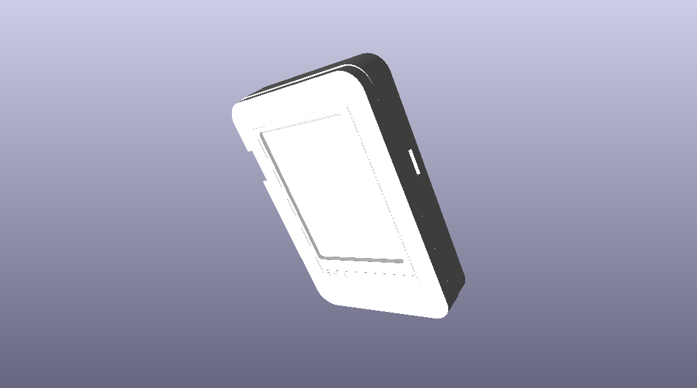
**3d render, of back**
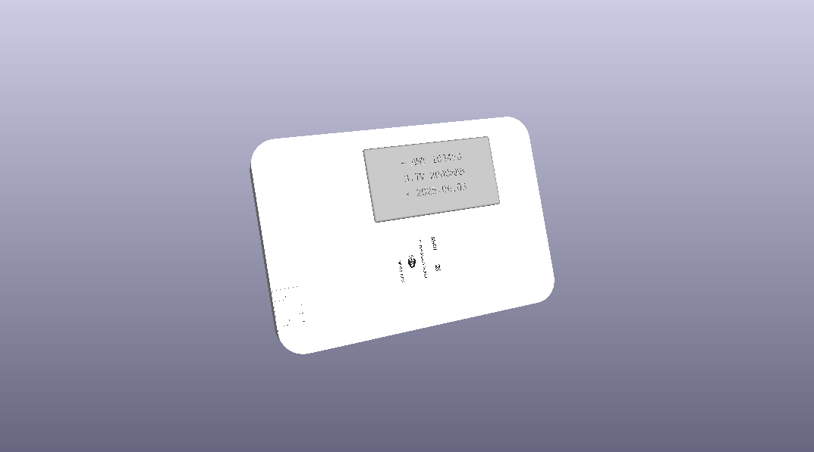
**pcb layout**
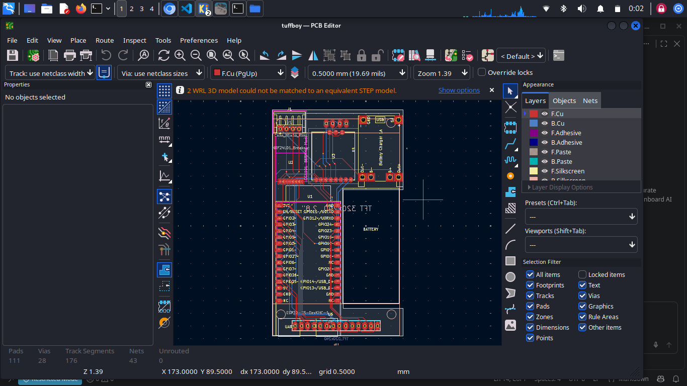
**the 4-pin expansion connector**
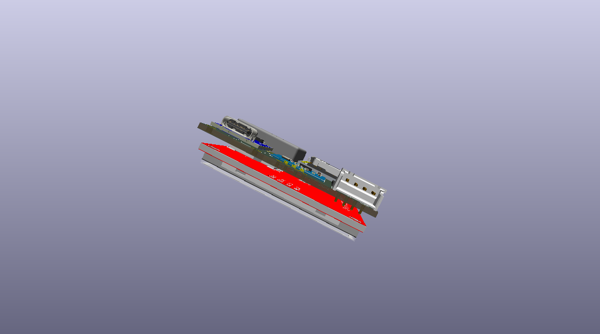
**Schematic**
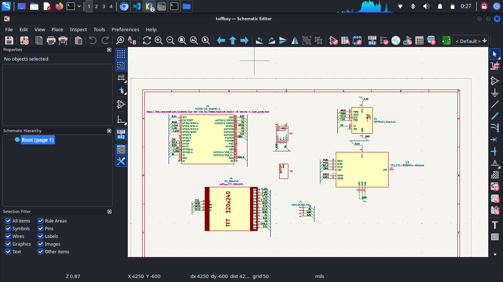

## what is this

So the Flipper is cool but it's ot that good in base form and expensive, and things like M5 Stacks can't really do proper wifi work(absence of 5ghz). TuffBoy is my take on what that device *should* be:

- **ESP32-C5** as the main brain — wifi 5GHz/2.4GHz + BLE, USB-C
- **nRF24L01+** for 2.4GHz radio stuff
- **CC1101** for sub-GHz (300–928 MHz)
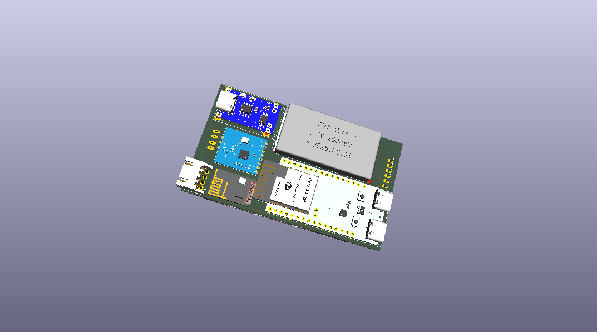
- **TFT** — a 2.8" inch which is fully touch no button which makes it look like a small phone.
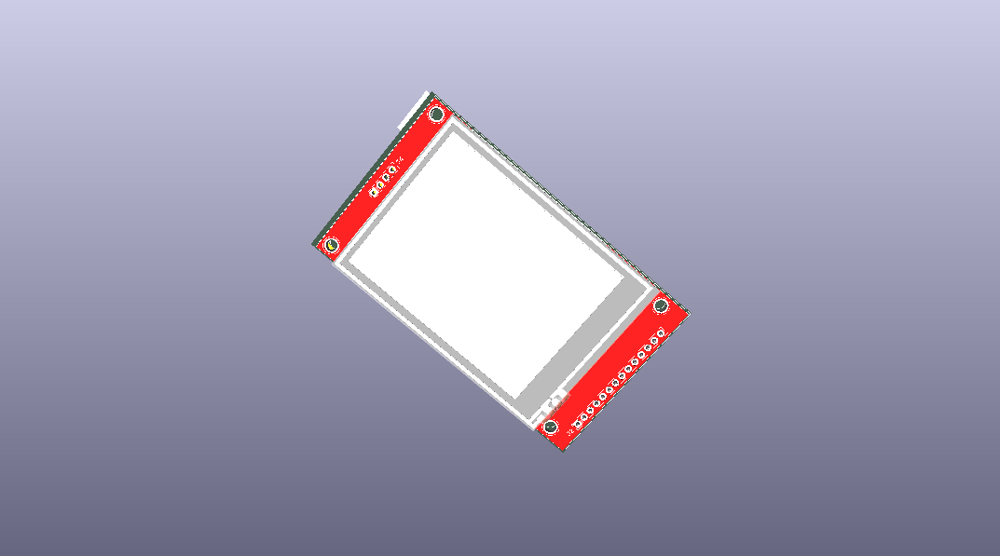

it's being made with the help of [Hack Club](https://hackclub.com/) 

## the uart extension (the big idea)

every flipper-clone has the same problem: you get one MCU and that's it. the TuffBoy has an **expansion port for a second microcontroller**:

- plug in a **STM32 Black Pill** (or any dev board that runs on 3.3V logic)
- the ESP32-C5 stays the brain (UI, wifi, displays) and the STM32 becomes a co-processor for whatever you want — real-time tasks, extra peripherals, other radio stacks, whatever you can think of
- the connection is a simple **4-pin jst connector: TX, RX, 3.3V and GND** (J1 on the board) — no special hardware, just serial
- since it's just TX/RX + power, basically any 3.3V board fits — black pill, another xiao, whatever you have lying around

with this we can add basically anything we like, without redesigning the main board every time. new feature = new daughter board / new firmware, not a new device.

## wifi hack firmware (The core idea)

the main focus of the software is my **"wifi hack" firmware** — the whole reason I started this. wifi hacking is weirdly hard to do on existing pocket tools; the Flipper can't do it properly at all and M5 stacks are clunky for it as both lacks a 5ghz radio and in my country no one uses 2.4ghz anymore so no way to capture hand shake. the goal is a firmware that makes wifi security testing *easy*, straight from the device UI:

- scan / monitor mode
- deauth + handshake capture workflows
- works on **2.4GHz AND 5GHz** wifi — the esp32-c5 has 5ghz wifi built in, and **basically no pocket tool does 5ghz**. flipper can't, m5 can't. this is the rare one.

**obviously: use it only on networks you own or have permission to test. this is a learning tool, not a crime stick.**

## catching up to the flipper (then passing it)

the flipper has a bunch of stuff mine doesn't (yet). here's the honest status on each:

| feature | flipper | tuffboy |
|---|---|---|
| sub-ghz radio | yes | yes already on board (cc1101) |
| 2.4GHz radio | yes | yes already on board (nrf24l01+) |
| wifi | no | yes 2.4 + **5GHz** — the thing flipper can't do |
| stm32 / co-processor expansion | no | yes 4-pin connector already on board |
| IR blaster | yes | planned, needs an IR led + receiver on the next rev |
| RFID 125kHz | yes | planned, needs extra hardware |
| NFC 13.56MHz | yes | planned, needs extra hardware (pn532 or similar) |
| iButton | yes | planned, 1-wire on a gpio, firmware work |
| USB HID / badUSB | yes | planned, the c5 has native usb, so this is firmware-only |
| U2F security key | yes | planned, same, firmware work |
| open expansion for any 3.3v board | no | yes |

so the plan: everything the flipper does gets added over a few board revs + firmware, and the flipper literally can't do wifi (or take a second mcu) — that's where tuffboy stays ahead.

## software status

There is no custom software **yet** for now but i have modified it to work with tuff boy.

## current progress

- [x] part selection + custom symbols/footprints (esp32_c5 lib: XIAO SMD footprint, cc1101, oled)
- [x] schematic — all blocks placed (mcu, 2 radios, 2 displays, 4 buttons, battery + headers)
- [x] board outline + placement
- [x] first hand-routed nets (radio area, battery area)
- [x] finish routing + ground pour
- [x] decoupling caps (none placed yet, don't judge)
- [x] DRC clean + renders
- [x] order prototype
- [x] stm32 expansion connector on the board (J1 = TX, RX, 3V3, GND)
- [x] firmware (after parts arrive)

## bill of materials

| Name | Quantity | Description | Buy Link | Price |
|---|---|---|---|---|
| ESP32-C5-DevKitC-1 | 1 | ESP32-C5 WiFi 6/6E Mini Module (2.4GHz + 5GHz) | [Link](https://robu.in/product/waveshare-esp32-c5-dual-band-wi-fi-6-development-board/) | 1339 rs |
| NRF24L01_Breakout | 1 | nRF24L01+ 2.4GHz RF Transceiver Module | [Link](https://quartzcomponents.com/collections/all/products/rf-module-2-4ghz-nrf24l01-smd) | 113 rs |
| CC1101-868MHz-Module | 1 | CC1101 868/915 MHz Sub-GHz RF Module | [Link](https://quartzcomponents.com/products/cc1101-868mhz-wireless-transceiver-module) | 247 rs |
| TFT_320x240 | 1 | 2.4" TFT LCD Display 320x240 Touch Screen | [Link](https://robu.in/product/2-8-inch-spi-touch-screen-module-tft-interface-240320/) | 959 rs |
| TP4056 | 1 | TP4056 Lithium Battery Charging Module | [Link](https://robocraze.com/products/tp4056-battery-charger-c-type-module-with-protection-1) | 16 rs |
| battery | 4 | 18650 Li-Ion Battery (3.7V) | [Link](https://quartzcomponents.com/collections/all/products/3-7v-500mah-li-po-rechargeable-battery-for-boat-wireless-bluetooth) | 122 rs each |
| uart Connector | 1 | JST EH Series 4-Pin Connector (Expansion Port) | [Link](https://quartzcomponents.com/collections/all/products/4-pin-jst-xh-male-connector-5-24mm-pitch) | 2 rs |
| zero pcb | 5 | making the fist pcb | [Link](https://quartzcomponents.com/products/perf-board-dotted-board-general-purpose-pcb-15x10cm) | 29 rs each |
| soldering kit | 1 | making my pcb | [Link](https://www.amazon.in/Soldering-180-500%C2%B0C-Adjustable-Desoldering-Tweezers/dp/B0H2DF7V5R/) | 1399 rs |
| jumper cables | 2 | for wiring | [Link](https://quartzcomponents.com/products/jumper-wires-combo-pack-male-to-male-male-to-female-female-to-female-set-of-120) | 159 rs each |
| soldering stand | 1 | for soldering | [Link](https://www.amazon.in/Catchex-Helping-Magnifier-Soldering-Dual-Mode/dp/B08MQX9L5N/) | 694 rs |
| soldering wick | 2 | for soldering | [Link](https://quartzcomponents.com/products/desoldering-braid-solder-remover-wick) | 18 rs each |
| jst female | 2 | needed | [Link](https://quartzcomponents.com/collections/all/products/4-pin-jst-sm-connector-with-wire-5-24mm-pitch) | 13 rs each |

**Total: 5782 rs (approx. $60 USD)**

## files
tuffboy/ the kicad 10 project (sch + pcb)
tuffboy.pretty/ third-party libs (xiaosymbols, ssd1306 footprints etc)
CAD/ step models (esp32-c5, nrf24l01, cc1101, oleds, 603040 battery)
images/ pcb renders + board pics (see full list in Images section above)
firmware/ Modefied bruce.

open `tuffboy/tuffboy.kicad_pro` in kicad 10 and you're good.

## credits
- completely mad by ishant dahiya
- inspired by the [Flipper Zero](https://flipperzero.one/) (obviously)
- [Hack Club](https://hackclub.com/) for the support
---

## Images

| Image | Description |
|-------|-------------|
|  | 3D model of the device |
| 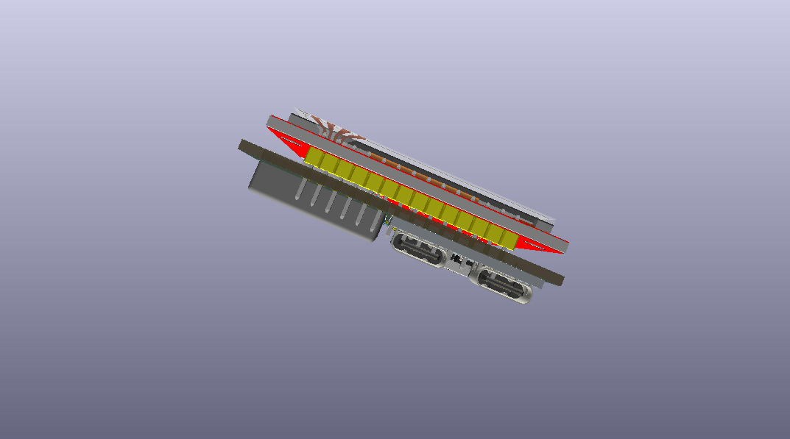 | USB-C connector detail |
|  | PCB layout |
|  | Schematic |
|  | Top view of the device |
| 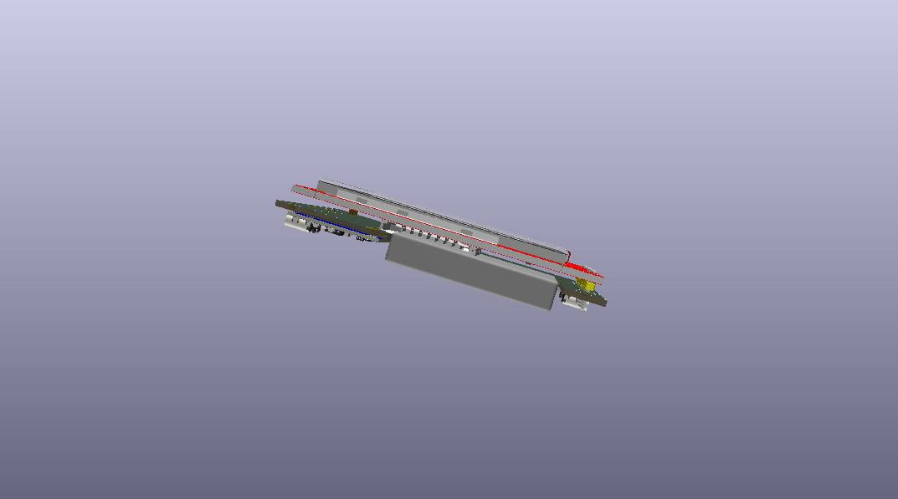 | SD card slot |
| 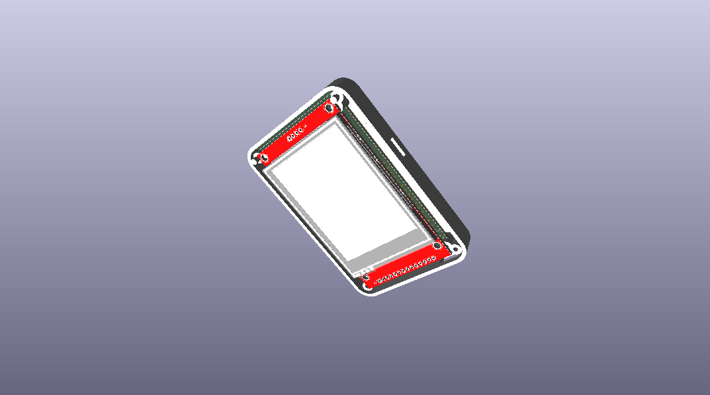 | Back cover |
|  | 3D render of back |
| 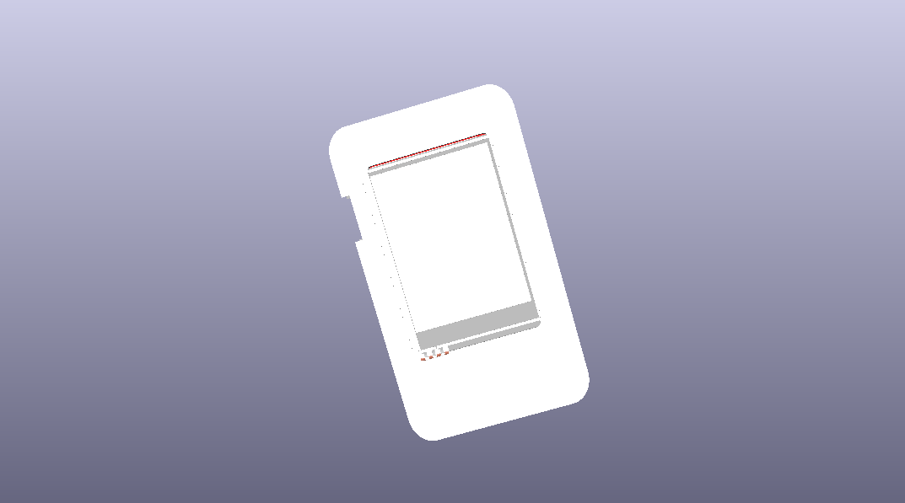 | Top cover |
|  | 4-pin JST expansion connector |
|  | Back view of the device |

---

*hardware: alpha · software: brainstorming · last updated sep 2026*
