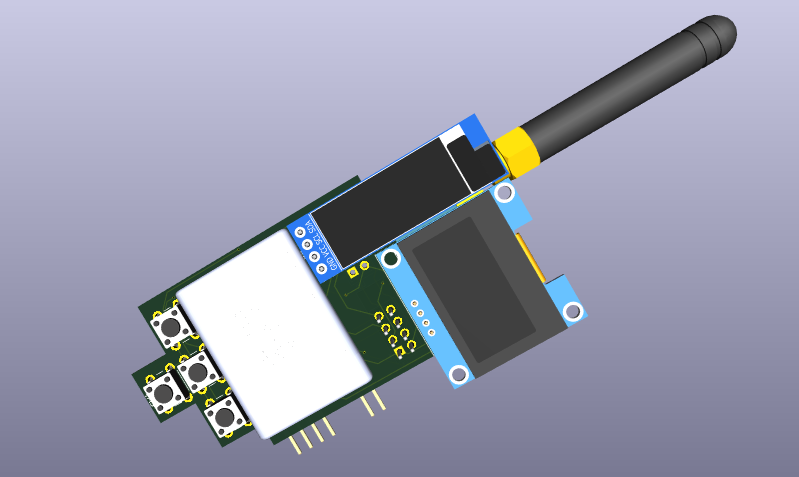
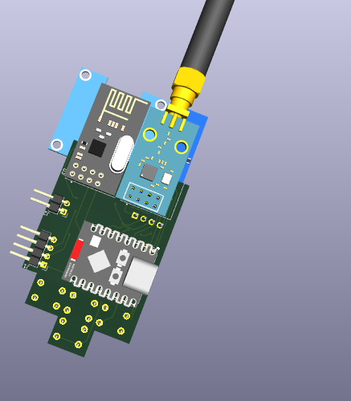
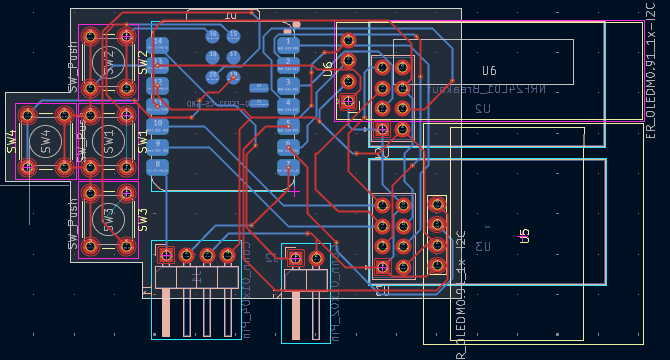
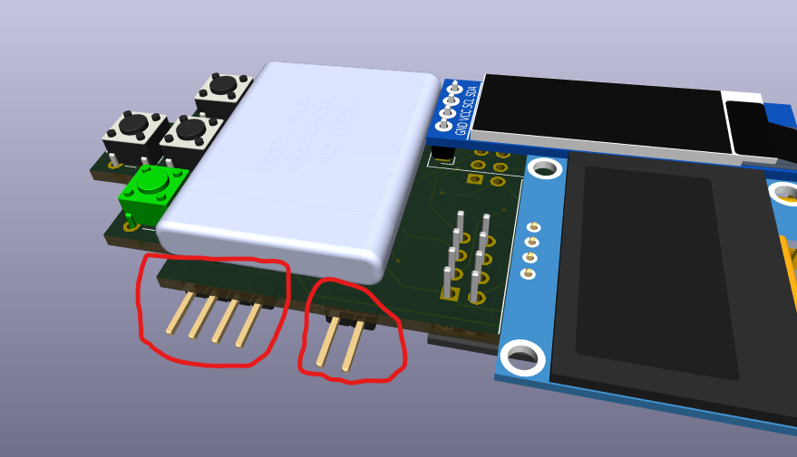

# TuffBoy

A handheld multi-tool inspired by the Flipper Zero, but built around the ESP32-C5 with **two radios** (2.4GHz + sub-GHz), **two OLED screens** and a big idea: an expansion port that lets you bolt on a whole second microcontroller (Black Pill, or basically any 3.3V dev board).

This is the part that makes TuffBoy ~200× more flexible than a Flipper — instead of being stuck with whatever the factory gave you, you plug in whatever co-processor the task needs.

  

**the board so far:**






## what is this

So the Flipper is cool but it's closed and expensive, and things like M5 Stacks can't really do proper wifi work. TuffBoy is my take on what that device *should* be:

- **ESP32-C5** as the main brain — wifi 5GHz/2.4GHz + BLE, USB-C
- **nRF24L01+** for 2.4GHz radio stuff
- **CC1101** for sub-GHz (300–928 MHz)
- **two OLEDs** — a 1.3" 128x64 main screen + a 0.91" 128x32 status screen (so you can keep radio info visible while navigating menus)
- **4 buttons** for input
- **LiPo battery** (603040, ~600mAh) + the STM32 expansion port (more on that below)

it's being made with the help of [Hack Club](https://hackclub.com/) 🎉

## the stm32 extension (the big idea)

every flipper-clone has the same problem: you get one MCU and that's it. the TuffBoy has an **expansion port for a second microcontroller**:

- plug in a **STM32 Black Pill** (or any dev board that runs on 3.3V logic)
- the ESP32-C5 stays the brain (UI, wifi, displays) and the STM32 becomes a co-processor for whatever you want — real-time tasks, extra peripherals, other radio stacks, whatever you can think of
- the connection is a simple **4-pin connector: TX, RX, 3.3V and GND** (J1 on the board) — no special hardware, just serial
- since it's just TX/RX + power, basically any 3.3V board fits — black pill, another xiao, whatever you have lying around

with this we can add basically anything we like, without redesigning the main board every time. new feature = new daughter board / new firmware, not a new device.

## wifi hack firmware

the main focus of the software is my **"wifi hack" firmware** — the whole reason I started this. wifi hacking is weirdly hard to do on existing pocket tools; the Flipper can't do it properly at all and M5 stacks are clunky for it. the goal is a firmware that makes wifi security testing *easy*, straight from the device UI:

- scan / monitor mode
- deauth + handshake capture workflows
- works on **2.4GHz AND 5GHz** wifi — the esp32-c5 has 5ghz wifi built in, and basically no pocket tool does 5ghz. flipper can't, m5 can't. this is the rare one.
- all controlled from the 1.3" screen with the 4 buttons

⚠️ obviously: use it only on networks you own or have permission to test. this is a learning tool, not a crime stick.

## catching up to the flipper (then passing it)

the flipper has a bunch of stuff mine doesn't (yet). here's the honest status on each:

| feature | flipper | tuffboy |
|---|---|---|
| sub-ghz radio | ✅ | ✅ already on board (cc1101) |
| 2.4GHz radio | ✅ | ✅ already on board (nrf24l01+) |
| wifi | ❌ | ✅ 2.4 + **5GHz** — the thing flipper can't do |
| stm32 / co-processor expansion | ❌ | ✅ 4-pin connector already on board |
| IR blaster | ✅ | 🔜 needs an IR led + receiver on the next rev |
| RFID 125kHz | ✅ | 🔜 needs extra hardware |
| NFC 13.56MHz | ✅ | 🔜 needs extra hardware (pn532 or similar) |
| iButton | ✅ | 🔜 1-wire on a gpio, firmware work |
| USB HID / badUSB | ✅ | 🔜 the c5 has native usb, so this is firmware-only |
| U2F security key | ✅ | 🔜 same, firmware work |
| dual screens | ❌ | ✅ |
| open expansion for any 3.3v board | ❌ | ✅ |

so the plan: everything the flipper does gets added over a few board revs + firmware, and the flipper literally can't do wifi (or take a second mcu) — that's where tuffboy stays ahead.

## software status

there is **no software yet** — just a lot of brainstorming. the plan is:

1. finish the PCB and order it
2. get the parts in hand
3. *then* write the firmware (displays first, then radios, then wifi hack, then the STM32 link protocol)

that's why this repo is just a quick overview for now. firmware will be uploaded here once the hardware exists.

## current progress

- [x] part selection + custom symbols/footprints (esp32_c5 lib: XIAO SMD footprint, cc1101, oled)
- [x] schematic — all blocks placed (mcu, 2 radios, 2 displays, 4 buttons, battery + headers)
- [x] board outline + placement
- [x] first hand-routed nets (radio area, battery area)
- [ ] finish routing + ground pour
- [ ] decoupling caps (none placed yet, don't judge)
- [ ] DRC clean + renders
- [ ] order prototype
- [x] stm32 expansion connector on the board (J1 = TX, RX, 3V3, GND)
- [ ] firmware (after parts arrive)

## pinout (current)

| xiao pin | goes to |
|---|---|
| D0 | CC1101 CSN |
| D1 | CC1101 GDO0 |
| D2 | nRF24 CE |
| D3 | nRF24 CSN |
| D4 | I2C SDA → both OLEDs |
| D5 | I2C SCL → both OLEDs |
| D8 | SPI SCK (shared, both radios) |
| D9 | SPI MISO (shared) |
| D10 | SPI MOSI (shared) |
| D6, D7 | J1 → the stm32 port (TX / RX) |
| MTDI/MTDO/MTMS/MTCK | the 4 buttons (using the module's underside pads) |
| VBUS | battery in via J2 |

radios share one SPI bus with separate CS pins, displays share one I2C bus. buttons are active-low with internal pullups.

## known issues / stuff i'm still figuring out

1. the 1.3" display (U5) is using the 0.91" symbol right now — needs the real SH1106 symbol/footprint
2. both OLEDs are on one I2C bus — need to confirm they can get different addresses (0x3C/0x3D)
3. CC1101 GDO2 is tied to GND — should probably go to a GPIO instead
4. battery feeds the VBUS pin directly — need to check charging/protection (maybe add a TP4056)
5. buttons on MTDI/MTMS etc — need to double check boot strapping on the C5
6. no decoupling caps yet (see above)

## files

```
tuffboy/          the kicad 10 project (sch + pcb)
res/              third-party libs (xiaosymbols, ssd1306 footprints etc)
cad/              step models (esp32-c5, nrf24l01, cc1101, oleds, 603040 battery)
images/           pcb renders + board pics used in this readme
```

open `tuffboy/tuffboy.kicad_pro` in kicad 10 and you're good.

## credits

- inspired by the [Flipper Zero](https://flipperzero.one/) (obviously)
- [Hack Club](https://hackclub.com/) for the support
- seeed xiao community libs + ssd1306 footprint lib

---

*hardware: pre-alpha · software: brainstorming · last updated sep 2026*
