# TuffBoy
**NOTE for admin** : I have been working on this project form then 70+ hrs i have made so much progress and learned so many things you asked me add the things like bom and how will the make this those things are now added also your review stats that "Some of your journals although they have what you've done, kind of doesn't justify why you got the hours and has a brief explanation" I understand that you need proper journals and all i have tried to make the journals bigger and they describe what i did but thee main problem i myself does not remember what i did like 2 or 3 weeks ago that's why i can't full full fill your journal criteria also you guys states that the hours does not justify tbh i am very very new in this tech field i learned kicad from ground zero that's why it takes time to make the pcb to find the parts for the pcb design i am not a pro at the end so if you check any lapse with the devlog you can see that was working only not afk but my speed has now increased also some of the journals were i shifted to linux the lapse are not there becuase i thought that lookout only works in windows so pls keep that in mind. I really hope that this time my project gets selected.  

A handheld multi-tool inspired by the Flipper Zero, but built around the ESP32-C5 Devkit C with **Dual Band** (2.4GHz + 5Ghz), and a big idea: an expansion port that lets you bolt on a whole second microcontroller (Black Pill, or basically any 3.3V dev board).

This is the part that makes TuffBoy ~200× more flexible than a Flipper — instead of being stuck with only 2.4 GHz WiFi we have a breakthrough with the support of 5GHz, opening the door to WiFi security testing, along with support for plugging in whatever co-processor the task needs.

  

**TuffBoy so far:**

**Circuit diagram:**

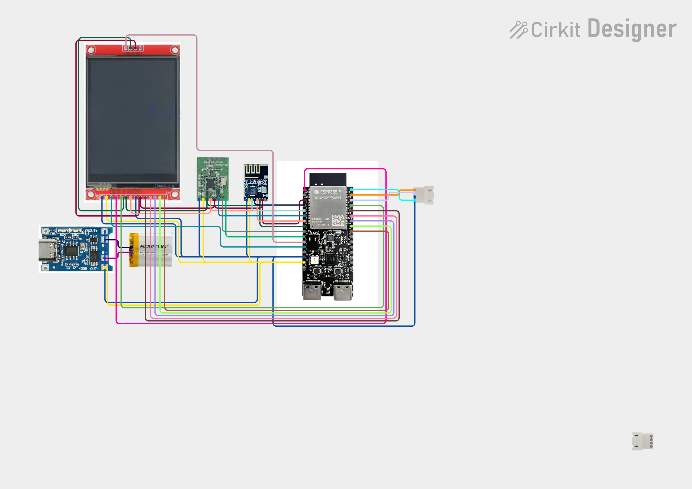

**3d model of the device**

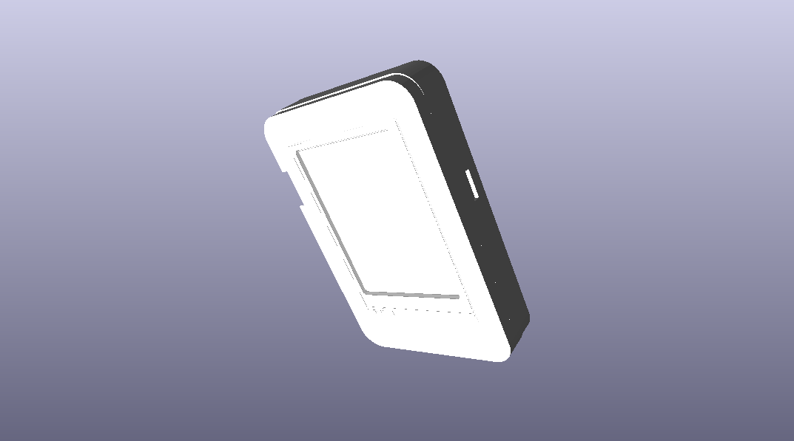

**3d render, of back**

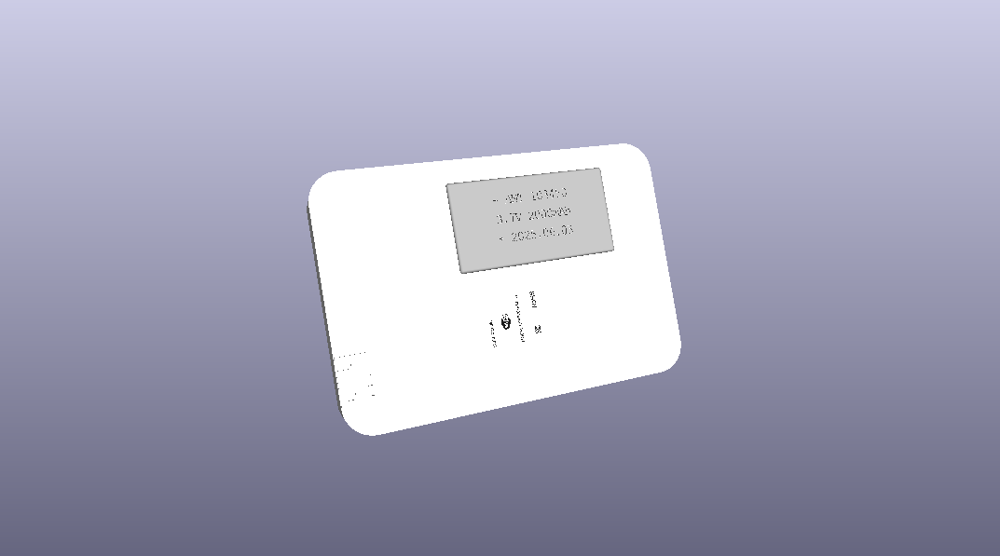

**pcb layout**

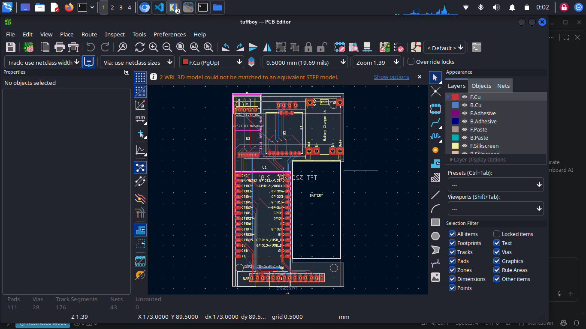

**the 4-pin expansion connector**

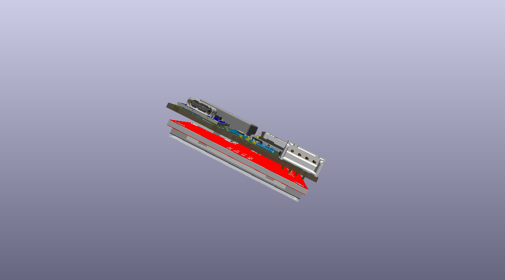

**Schematic**

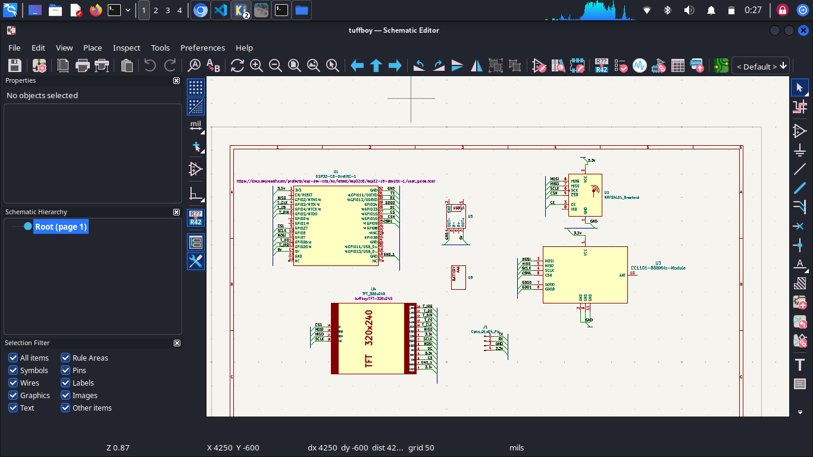

## what is this

So the Flipper is cool but it's not that good in base form and expensive, and things like M5 Stacks can't really do proper wifi work (absence of 5GHz). TuffBoy is my take on what that device *should* be:

* **ESP32-C5** as the main brain — wifi 5GHz/2.4GHz + BLE, USB-C
* **nRF24L01+** for 2.4GHz radio stuff
* **CC1101** for sub-GHz (300–928 MHz)

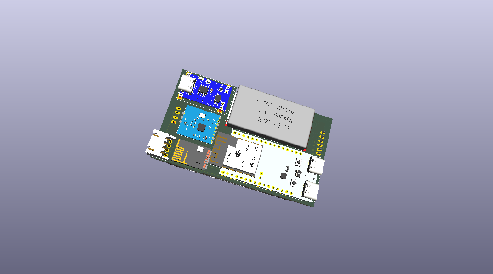

* **TFT** — a 2.8" inch which is fully touch, no button, which makes it look like a small phone.

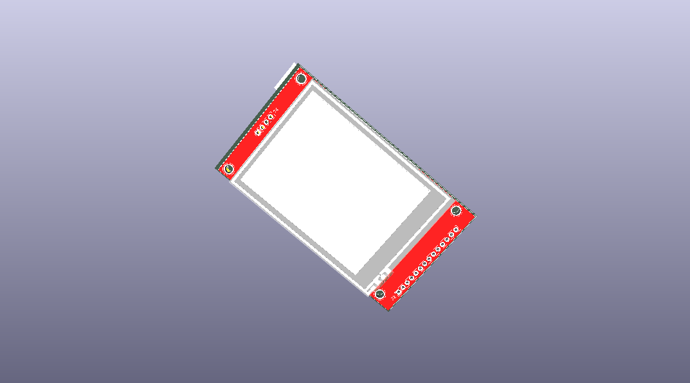

It's being made with the help of [Hack Club](https://hackclub.com/).

## How to make one:

To make one just see the circuit diagram images and copy it then add the script which is in the firmware folder in the esp32 c5 that's all as simple as you see.
How will i make it i preffer to make this on a zero pcb first that will hlep me fix any problems with the pcb. Also if you want to know the wiring here its is:

## Wiring

### Main Controller

The TuffBoy is built around an **ESP32-C5 DevKit-C**. The TFT, CC1101, and nRF24L01+ modules communicate with the ESP32-C5 using SPI, while the 4-pin JST-SH connector provides a UART expansion interface.

### Pin Assignment

| ESP32-C5 GPIO | Connection | Function |
|---|---|---|
| GPIO 6 | SPI SCK | Shared SPI clock |
| GPIO 7 | SPI MOSI | Shared SPI data output |
| GPIO 2 | SPI MISO | Shared SPI data input |
| GPIO 10 | TFT CS | TFT chip select |
| GPIO 3 | TFT DC | TFT data/command |
| GPIO 4 | TFT RST | TFT reset |
| GPIO 5 | TFT BL | TFT backlight control |
| GPIO 8 | Touch CS | Touch controller chip select |
| GPIO 9 | Touch IRQ | Touch interrupt |
| GPIO 0 | CC1101 CS | CC1101 chip select |
| GPIO 1 | CC1101 GDO0 | CC1101 interrupt/status |
| GPIO 18 | nRF24 CSN | nRF24 chip select |
| GPIO 19 | nRF24 CE | nRF24 chip enable |
| GPIO 20 | nRF24 IRQ | nRF24 interrupt |
| GPIO 21 | UART TX | JST-SH TX |
| GPIO 22 | UART RX | JST-SH RX |

> **Note:** GPIO numbers are the proposed firmware/pinout assignment for TuffBoy. Verify them against the exact ESP32-C5 DevKit-C board and your final PCB before manufacturing.

---

## 2.8" SPI TFT + Touch

The TFT uses the ESP32-C5's SPI bus.

| TFT Pin | ESP32-C5 |
|---|---|
| VCC | 3.3V |
| GND | GND |
| SCK / CLK | GPIO 6 |
| MOSI / SDI | GPIO 7 |
| MISO / SDO | GPIO 2 |
| CS | GPIO 10 |
| DC / RS | GPIO 3 |
| RST | GPIO 4 |
| BL / LED | GPIO 5 |

### Touch Controller

For a typical XPT2046-style SPI touch controller:

| Touch Pin | ESP32-C5 |
|---|---|
| VCC | 3.3V |
| GND | GND |
| T_CLK | GPIO 6 |
| T_DIN | GPIO 7 |
| T_DO | GPIO 2 |
| T_CS | GPIO 8 |
| T_IRQ | GPIO 9 |

The TFT and touch controller share the SPI clock, MOSI and MISO lines. Separate chip-select lines allow the ESP32-C5 to communicate with each device independently.

---

## CC1101

The CC1101 uses the same SPI bus as the TFT and touch controller.

| CC1101 Pin | ESP32-C5 |
|---|---|
| VCC | 3.3V |
| GND | GND |
| SCK | GPIO 6 |
| MOSI / SI | GPIO 7 |
| MISO / SO | GPIO 2 |
| CSN / CS | GPIO 0 |
| GDO0 | GPIO 1 |

The CC1101 SPI bus is shared with the other SPI peripherals. Its dedicated CS pin is used to select the CC1101.

**Important:** The CC1101 module must be operated at the appropriate supply voltage for the specific module. Do not assume a 5V logic interface is safe.

---

## nRF24L01+

The nRF24L01+ also shares the main SPI bus.

| nRF24L01+ Pin | ESP32-C5 |
|---|---|
| VCC | 3.3V |
| GND | GND |
| SCK | GPIO 6 |
| MOSI | GPIO 7 |
| MISO | GPIO 2 |
| CSN | GPIO 18 |
| CE | GPIO 19 |
| IRQ | GPIO 20 |

The nRF24L01+ uses the shared SPI bus while **CSN** and **CE** remain dedicated to the module.

> **Power note:** The nRF24L01+ can be sensitive to supply noise. Place a decoupling capacitor close to the module's VCC and GND pins.

---

## 4-Pin JST-SH Expansion Connector

The 4-pin JST-SH connector provides power and a UART interface for an external 3.3V-compatible microcontroller or expansion board.

| JST-SH Pin | ESP32-C5 | Function |
|---|---|---|
| Pin 1 | GND | Ground |
| Pin 2 | 3.3V | VCC |
| Pin 3 | GPIO 21 | TX |
| Pin 4 | GPIO 22 | RX |

### Connector Layout

```text
JST-SH 4-Pin

┌───────────────┐
│ 1 │ 2 │ 3 │ 4 │
└───────────────┘
  │   │   │   │
  │   │   │   └── RX
  │   │   └────── TX
  │   └────────── 3.3V
  └────────────── GND

## the uart extension (the big idea)

Every flipper-clone has the same problem: you get one MCU and that's it. The TuffBoy has an **expansion port for a second microcontroller**:

* plug in a **STM32 Black Pill** (or any dev board that runs on 3.3V logic)
* the ESP32-C5 stays the brain (UI, wifi, displays) and the STM32 becomes a co-processor for whatever you want — real-time tasks, extra peripherals, other radio stacks, whatever you can think of
* the connection is a simple **4-pin jst connector: TX, RX, 3.3V and GND** (J1 on the board) — no special hardware, just serial
* since it's just TX/RX + power, basically any 3.3V board fits — black pill, another xiao, whatever you have lying around


With this we can add basically anything we like, without redesigning the main board every time. New feature = new daughter board / new firmware, not a new device.

## wifi hack firmware (The core idea)

The main focus of the software is my **"wifi hack" firmware** — the whole reason I started this. Wifi security testing is weirdly hard to do on existing pocket tools; the Flipper can't do it properly at all and M5 stacks are clunky for it as both lack a 5GHz radio. The goal is a firmware that makes wifi security testing *easy*, straight from the device UI:

* scan / monitor mode
* deauth + handshake capture workflows
* works on **2.4GHz AND 5GHz** wifi — the esp32-c5 has 5GHz wifi built in, and **basically no pocket tool does 5GHz**. flipper can't, m5 can't. this is the rare one.

**obviously: use it only on networks you own or have permission to test. this is a learning tool, not a crime stick.**

## catching up to the flipper (then passing it)

The flipper has a bunch of stuff mine doesn't (yet). here's the honest status on each:

| feature                           | flipper | tuffboy                                            |
| --------------------------------- | ------- | -------------------------------------------------- |
| sub-ghz radio                     | ✅       | ✅ already on board (cc1101)                        |
| 2.4GHz radio                      | ✅       | ✅ already on board (nrf24l01+)                     |
| wifi                              | ❌       | ✅ 2.4 + **5GHz** — the thing flipper can't do      |
| stm32 / co-processor expansion    | ❌       | ✅ 4-pin connector already on board                 |
| IR blaster                        | ✅       | 🔜 needs an IR led + receiver on the next rev      |
| RFID 125kHz                       | ✅       | 🔜 needs extra hardware                            |
| NFC 13.56MHz                      | ✅       | 🔜 needs extra hardware                            |
| iButton                           | ✅       | 🔜 1-wire on a gpio, firmware work                 |
| USB HID / badUSB                  | ✅       | 🔜 the c5 has native usb, so this is firmware-only |
| U2F security key                  | ✅       | 🔜 same, firmware work                             |
| open expansion for any 3.3v board | ❌       | ✅                                                  |

So the plan: everything the flipper does gets added over a few board revs + firmware, and the flipper literally can't do wifi (or take a second mcu) — that's where tuffboy stays ahead.

## software status

The project currently has two firmware paths. You can either use the included TuffBoy starter/custom firmware or clone Bruce and continue from that firmware project.

### Use the TuffBoy firmware

The native starter firmware is located at [`firmware/TuffBoy/TuffBoy.ino`](firmware/TuffBoy/TuffBoy.ino). It is written for the ESP32-C5 Arduino framework and currently provides:

* boot diagnostics and chip information
* configurable LED status indicator
* expansion UART test messages
* I2C bus scanning
* Wi-Fi station mode and nearby-network scanning
* a serial command interface (`help`, `status`, `wifi`, `i2c`, `led`, and more)

The LED, I2C, and expansion UART pins are defined as constants at the top of the sketch because the final pin mapping may change between board revisions. The sketch uses the ESP32 Arduino framework APIs and the built-in `Wire` and `WiFi` libraries.

The project also contains custom firmware developed specifically for TuffBoy, which will be used as the project continues beyond the initial hardware testing stage.

### Clone Bruce firmware

The [`firmware/Bruce Firmware Cloner.py`](firmware/Bruce%20Firmware%20Cloner.py) script downloads the [Bruce firmware](https://github.com/pr3y/Bruce) into a `Bruce/` directory. It requires Python 3.7 or newer. Git is used by default, or the `--zip` option can download an archive without Git.

```bash
# Clone Bruce into the current directory
python3 "firmware/Bruce Firmware Cloner.py"

# Shallow clone into a chosen directory
python3 "firmware/Bruce Firmware Cloner.py" -d ~/projects --depth 1

# Download Bruce as a ZIP archive instead of using Git
python3 "firmware/Bruce Firmware Cloner.py" -d ~/projects --zip
```

Useful options are `--branch` for a specific branch and `--deps` to install the Python build dependencies used by Bruce. After cloning, follow Bruce's own board and build instructions in its repository.

## CAD and enclosure

The PCB uses 3D CAD models of the individual components mainly for **visualisation of the PCB and complete assembly**.

The individual component CAD models used in the PCB 3D model were downloaded from **GrabCAD**. These models are used to represent the physical components and their approximate placement in the complete assembly.

The **TuffBoy cover/enclosure was made according to the requirements of the project and the completed PCB**. The cover was made externally according to the required dimensions, component placement and mechanical requirements, and the STEP file was provided for use with the project.

## current progress

* [x] part selection + custom symbols/footprints (esp32_c5 lib: XIAO SMD footprint, cc1101, oled)
* [x] schematic — all blocks placed (mcu, 2 radios, 2 displays, 4 buttons, battery + headers)
* [x] board outline + placement
* [x] first hand-routed nets (radio area, battery area)
* [x] finish routing + ground pour
* [x] decoupling caps
* [x] DRC clean + renders
* [x] stm32 expansion connector on the board (J1 = TX, RX, 3V3, GND)
* [x] PCB design completed
* [x] custom TuffBoy firmware started
* [x] enclosure / cover STEP file

## files

```text
tuffboy/          the kicad 10 project (sch + pcb)
tuffboy.pretty/   third-party libs (xiaosymbols, ssd1306 footprints etc)
CAD/              step models (esp32-c5, nrf24l01, cc1101, oleds, 603040 battery)
images/           pcb renders + board pics
firmware/         TuffBoy custom firmware and Bruce cloning script
BOM.csv           bill of materials
Front Housing.step
Rear Housing.step
assembly(full)-reduced.stl
tuffboy(without case)-reduced.stl
```

Open `tuffboy/tuffboy.kicad_pro` in kicad 10 and you're good.

## credits

* completely made by ishant dahiya
* inspired by the [Flipper Zero](https://flipperzero.one/) (obviously)
* [Hack Club](https://hackclub.com/) for the support
* individual component CAD models sourced from **GrabCAD** for PCB visualisation
* TuffBoy cover/enclosure made according to the project requirements and provided as a STEP file

## BOM

Name,Quantity,Description,BuyLink,Price
ESP32-C5-DevKitC-1,1,ESP32-C5 WiFi 6/6E Mini Module (2.4GHz + 5GHz),https://robu.in/product/waveshare-esp32-c5-dual-band-wi-fi-6-development-board/?gad_source=1&gad_campaignid=17416544847&gbraid=0AAAAADvLFWcAhKjpKS-s-T5ga_nYdL_oZ&gclid=Cj0KCQjwzY7VBhDwARIsAFtPvBSCJiLuT1NXrFAtEAiCTnIfyfwz10suMZHzm03uu-T937S01YcnfV4aAvBoEALw_wcB,1339rs
NRF24L01_Breakout,1,nRF24L01+ 2.4GHz RF Transceiver Module,https://quartzcomponents.com/collections/all/products/rf-module-2-4ghz-nrf24l01-smd,113rs
CC1101-868MHz-Module,1,CC1101 868/915 MHz Sub-GHz RF Module,https://www.digirf.com/ahttps://quartzcomponents.com/products/cc1101-868mhz-wireless-transceiver-module,247rs
TFT_320x240,1,"2.4"" TFT LCD Display 320x240 Touch Screen",https://robu.in/product/2-8-inch-spi-touch-screen-module-tft-interface-240320/,959rs
TP4056,1,TP4056 Lithium Battery Charging Module,https://robocraze.com/products/tp4056-battery-charger-c-type-module-with-protection-1?variant=46170796261600&country=IN&currency=INR&utm_medium=product_sync&utm_source=google&utm_content=sag_organic&utm_campaign=sag_organic&utm_source=googleads&utm_medium=ppc&utm_campaign=24209724403&utm_content=_&utm_term=&campaignid=24209724403&adgroupid=&campaign=24209724403&gad_source=1&gad_campaignid=24204602840&gbraid=0AAAAADgHQvbPMGuDf6IKSNYK3mAYs7GPq&gclid=Cj0KCQjwzY7VBhDwARIsAFtPvBRJs9qowygo7dqe7Be8JHWSHUW2bmEze1dkwCvkXE_-SpmCKjvBSHMaAmgSEALw_wcB,16rs
battery,4,18650 Li-Ion Battery (3.7V),https://quartzcomponents.com/collections/all/products/3-7v-500mah-li-po-rechargeable-battery-for-boat-wireless-bluetooth,122x4 rs
uart Connector,1,JST EH Series 4-Pin Connector (Expansion Port),https://quartzcomponents.com/collections/all/products/4-pin-jst-xh-male-connector-5-24mm-pitch,2rs
zero pcb,5,"making the fist pcb ",https://quartzcomponents.com/products/perf-board-dotted-board-general-purpose-pcb-15x10cm,29x5 rs
soldering kit,1,making my pcb,https://www.amazon.in/Soldering-180-500%C2%B0C-Adjustable-Desoldering-Tweezers/dp/B0H2DF7V5R/ref=asc_df_B0H2DF7V5R?mcid=fac06c466bea383c9f9de4df1ada2f3f&tag=googleshopdes-21&linkCode=df0&hvadid=709963085987&hvpos=&hvnetw=g&hvrand=6880740136568805454&hvpone=&hvptwo=&hvqmt=&hvdev=c&hvdvcmdl=&hvlocint=&hvlocphy=9061709&hvtargid=pla-2495571989661&hvocijid=6880740136568805454-B0H2DF7V5R-&hvexpln=0&gad_source=1&th=1,1399rs
jumper cables,2,for wiring,https://quartzcomponents.com/products/jumper-wires-combo-pack-male-to-male-male-to-female-female-to-female-set-of-120?variant=45062852903146&country=IN&currency=INR&utm_medium=product_sync&utm_source=google&utm_content=sag_organic&utm_campaign=sag_organic&gad_source=1&gad_campaignid=20393598841&gbraid=0AAAAACPPFdMKBcfSVEY-nUhuyXm1wlDV4&gclid=Cj0KCQjwzY7VBhDwARIsAFtPvBRewQFkgKB1JRPOWMbdnzZBRzA7U79xPLyqfY1VizUegldmECB1gqUaApjVEALw_wcB,159x2 rs
soldering stand,1,for soldering,https://www.amazon.in/Catchex-Helping-Magnifier-Soldering-Dual-Mode/dp/B08MQX9L5N/ref=sr_1_1_sspa?crid=FTJHBQBUO2E5&dib=eyJ2IjoiMSJ9.6Q6KR2TueLLx1nzUo3dqAELZ5I-7egw83BdRRN6E2k6ea4hZ5IwFMWd1g0OCS7VsGGuxCJCDWpumhTcyq25LeKnd1ZiEPj0lzBRxpvn8j20aaU3k03o5N9xNIDq8-QH1gSEHMHa6HtuQ0R37wDeOta6G9H9JhxqAu-_MsIZFblusvtexT-ihc6ErvKeiv5GuokvnRaY_FccYQocbr5Y_Y1VWhGller9pPpP1UF92dlwKQX9JAjZHSJPEeUVAKig6AdTo_Vvtc4djI_zFSKch3pATpFlGXqsCq7bKzEVqsQs.sNLhgmx-CbrkAQKMNDARRboaHru4lVpfFbm_IsWxRTo&dib_tag=se&keywords=soldering+stand&qid=1789157310&sprefix=soldering+sta%2Caps%2C302&sr=8-1-spons&aref=D5Ohwj5oxm&sp_csd=d2lkZ2V0TmFtZT1zcF9hdGY&psc=1,694 rs
soldering wick,2,for soldering,https://quartzcomponents.com/products/desoldering-braid-solder-remover-wick?variant=31898067140743&country=IN&currency=INR&utm_medium=product_sync&utm_source=google&utm_content=sag_organic&utm_campaign=sag_organic&gad_source=1&gad_campaignid=20393598841&gbraid=0AAAAACPPFdMKBcfSVEY-nUhuyXm1wlDV4&gclid=Cj0KCQjwzY7VBhDwARIsAFtPvBQLumONmwllpPppLpWS5YPv0rClvczN1H7C6DntKvXrPcqMlQ9EcLoaAnmcEALw_wcB,18x2 rs
jst female,2,needed,https://quartzcomponents.com/collections/all/products/4-pin-jst-sm-connector-with-wire-5-24mm-pitch,13x2 rs
,,,,total = 5782 rs
,,,,total = $60.27
,,,,
,,,,


---

## Images

| Image                                     | Description                   |
| ----------------------------------------- | ----------------------------- |
|               | 3D model of the device        |
| 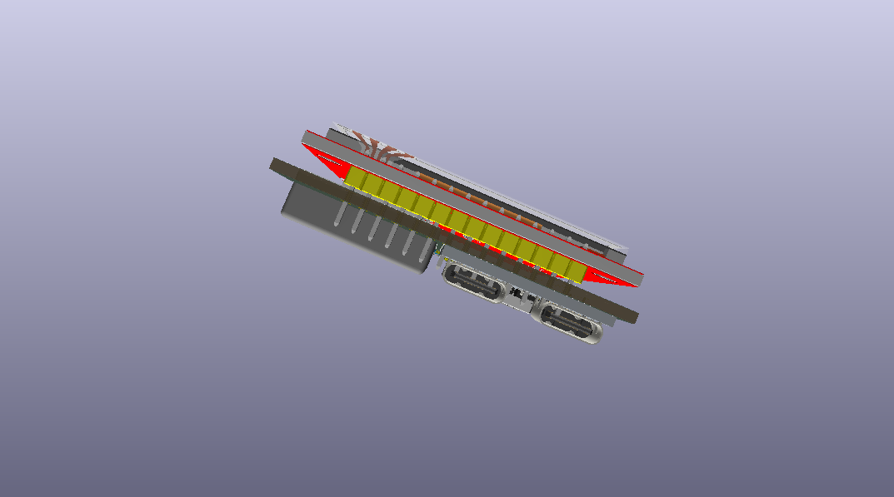         | USB-C connector detail        |
|                 | PCB layout                    |
|                 | Schematic                     |
|                 | Top view of the device        |
| 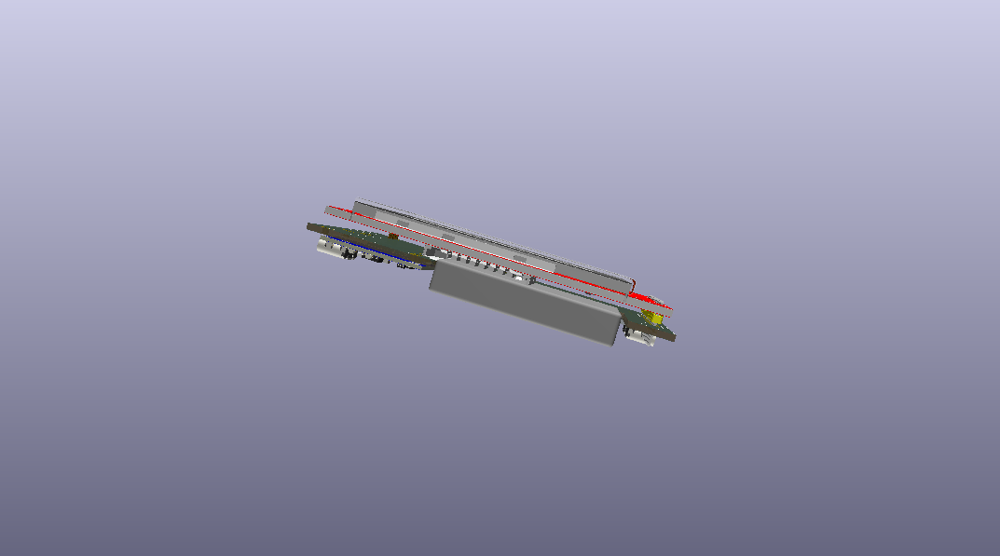                  | SD card slot                  |
| 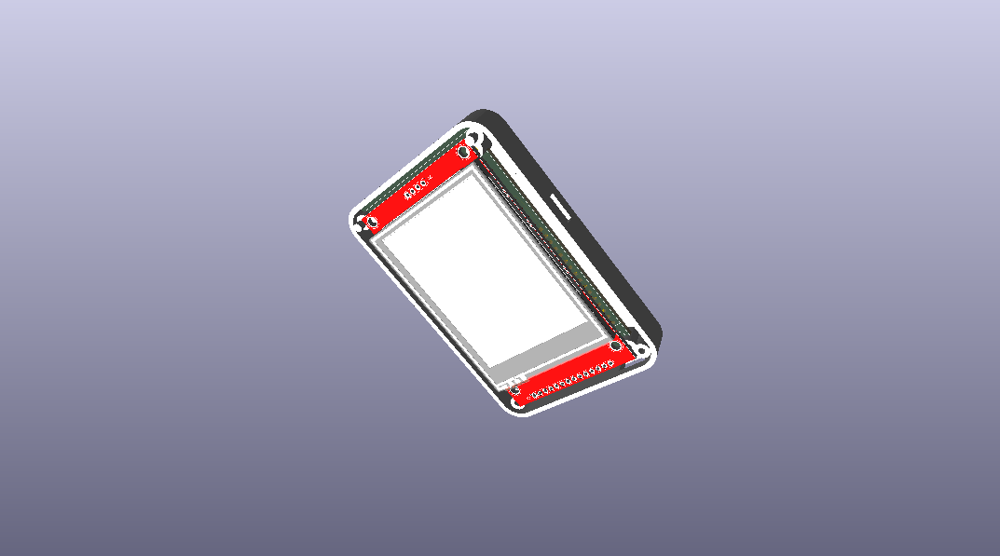 | Back cover                    |
|    | 3D render of back             |
| 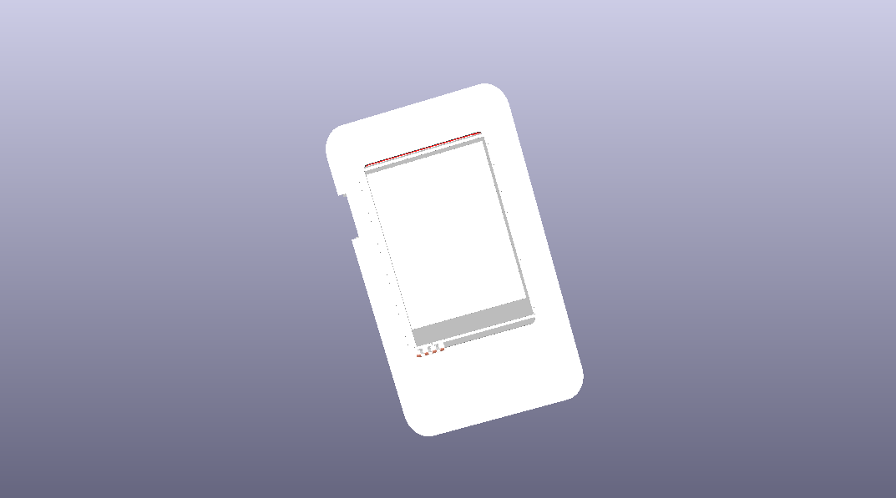   | Top cover                     |
|    | 4-pin JST expansion connector |
|               | Back view of the device       |

---

*hardware: PCB completed · software: custom firmware in development · last updated Sep 2026*
